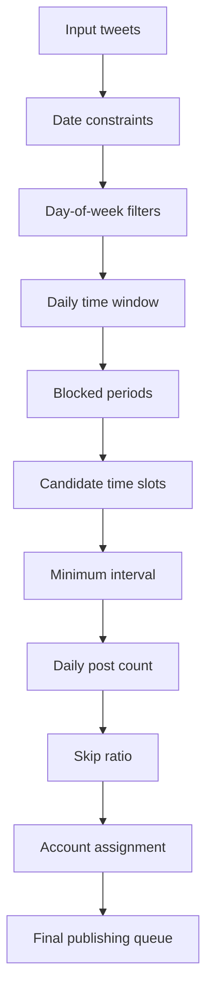
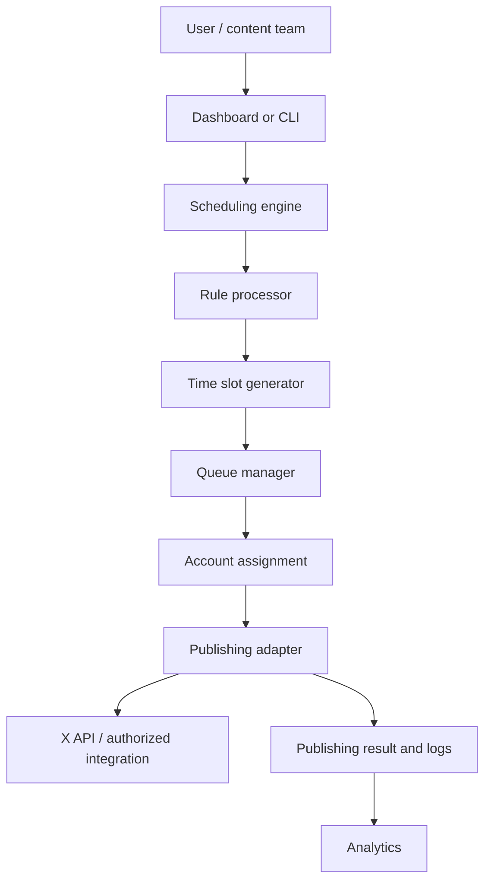

# X Bulk Scheduler

An open-source **Tweet scheduler** and technical reference for bulk tweets, flexible publishing rules, and responsible X/Twitter automation. The hard part of tweet scheduling is not posting one tweet; it is building a scheduling engine that handles real-world constraints: date ranges, weekdays, publishing windows, blocked periods, campaign pacing, daily capacity, minimum intervals, and multi-account queues.

## Why a Tweet Scheduler?

A simple “publish at this time” feature breaks down when a content team has a month of scheduled tweets, different campaign windows, lunch-hour blocks, per-day volume targets, or more than one authorized account. X Bulk Scheduler turns those rules into a deterministic, inspectable queue. It is a library and reference implementation, not a hosted auto-poster.

If you are comparing a **Twitter scheduling tool**, an **X scheduler**, or an **X scheduling** library, the key differentiator is how clearly it models constraints and auditability.

## The Problem

Content operators need to answer: Which tweets are eligible today? Which weekdays are allowed? Is the slot inside the daily time window? Does a blocked period apply? Is the previous post too recent? How many posts should this day receive? Which authorized account owns the next item? The engine applies those decisions in order and records `scheduled`, `published`, `failed`, and `retry` states for an adapter to consume.

## Features

- Date range with inclusive start and end dates.
- Days-of-week filters (Monday through Sunday).
- Daily time window such as 09:00–18:00.
- Blocked periods such as 12:00–14:00 for meetings or audience quiet hours.
- Skip ratio for schedule flexibility and campaign pacing, never for evading platform controls.
- Random daily post count between a minimum and maximum.
- Minimum interval between candidate slots.
- Seeded deterministic scheduling for reproducible tests and previews.
- CSV/JSON tweet import helpers.
- Round-robin multi-account assignment with account isolation.
- A small Node.js CLI that prints a queue and never publishes by itself.

## Scheduling Model



See [docs/scheduling-model.md](docs/scheduling-model.md) for the full algorithm and [docs/architecture.md](docs/architecture.md) for module boundaries.

## Quick Start

Requirements: Node.js 20+.

```bash
npm test
npm run lint
npm run build
npm run seo
node src/cli.js schedule --tweets examples/tweets.json --config examples/scheduler-config.json --accounts account-a,account-b
```

Library usage:

```js
import { scheduleBulk } from "x-bulk-scheduler";
import tweets from "./examples/tweets.json" with { type: "json" };

const queue = scheduleBulk(tweets, {
  schedule: {
    start_date: "2026-09-07",
    end_date: "2026-09-30",
    days: ["monday", "wednesday", "friday"],
    time_window: { start: "09:00", end: "18:00" },
    blocked_periods: [{ start: "12:00", end: "14:00" }],
    skip_ratio: 0.2,
    posts_per_day: { min: 3, max: 7 },
    minimum_interval_minutes: 45,
    seed: 42,
    timezone: "UTC"
  }
}, ["account-a", "account-b"]);
console.log(queue);
```

## Configuration

The configuration is implemented by `generateSchedule` and uses snake_case fields. See [docs/configuration.md](docs/configuration.md) for validation rules. Time calculations use UTC in this MVP; a production adapter should convert from the configured timezone before publishing.

## Multi-Account Scheduling

Pass authorized account identifiers to `scheduleBulk` for round-robin assignment. The engine does not log in, create accounts, obtain credentials, or bypass verification. See [docs/multi-account.md](docs/multi-account.md).

## Examples

- [examples/tweets.csv](examples/tweets.csv) and [examples/tweets.json](examples/tweets.json): minimal import formats.
- [examples/scheduler-config.yaml](examples/scheduler-config.yaml): reference configuration.
- [examples/python_scheduler.py](examples/python_scheduler.py): reference implementation example (pseudocode).
- [examples/node-scheduler.js](examples/node-scheduler.js): runnable Node example.

## Architecture



The publishing adapter is intentionally abstract. No X endpoint is hard-coded and no live publishing happens in this repository.

## Safety and Best Practices

Always comply with X platform policies, API limits, applicable laws, and account-specific restrictions. Use authorized accounts, validate content before publishing, respect rate limits, monitor failures, secure credentials, and keep daily limits conservative. Skip ratio means publishing flexibility or campaign pacing; it is not a way to bypass limits, evade detection, or guarantee account safety. This project never implements CAPTCHA bypass, anti-bot evasion, credential theft, or unauthorized access.

This is responsible **X automation**: the engine prepares an auditable queue for an authorized publishing adapter, while the operator remains accountable for approval and platform compliance.

## Screenshots
The source website exposes public interface imagery for its dashboard, account management, and automation modules. The docs/images/ path is reserved for authorized, brand-neutral captures; no image is included without a verified redistribution path. Any future capture must be labeled as source-product context, not as a screenshot of this reference implementation.


## FAQ

### What is a Tweet scheduler?

A tool that turns content and time rules into a queue of scheduled tweets.

### What is the difference between a Tweet scheduler and a bulk tweet scheduler?

A bulk tweet scheduler plans many records and applies capacity, spacing, import, and queue rules instead of handling one isolated post.

### Can tweets be scheduled across multiple days?

Yes. Set `start_date`, `end_date`, and allowed weekdays.

### Can I define specific publishing windows?

Yes. `time_window` and `blocked_periods` constrain candidate slots.

### What are blocked periods?

Explicit no-publish intervals used for quiet hours, meetings, or campaign rules.

### What is a skip ratio?

A 0–1 probability that skips a candidate slot to create flexible campaign pacing. It does not bypass X controls.

### Can I control the number of tweets published per day?

Yes. Use `posts_per_day.min` and `posts_per_day.max`.

### How does multi-account scheduling work?

The queue can use round-robin assignment across authorized account IDs. Per-account limits and persistence belong in a future adapter.

### Can I import tweets from CSV or JSON?

Yes. Helpers and sample files are included.

### Does this project bypass X API limits?

No. It supports responsible scheduling and platform compliance only.

## Disclaimer

Reference: https://www.tweetattackspro.com/

X (formerly Twitter) is governed by its own Terms of Service, platform policies, API rules, and automated activity restrictions.

This project is provided for legitimate development, research, testing, and other responsible use. Users are solely responsible for ensuring that their use of this project complies with X's policies, applicable laws, and other relevant requirements.

This project is not intended to facilitate spam, abusive activity, unauthorized access, or the circumvention of X's security, rate limits, or anti-abuse mechanisms.


## Contributing and License

Read [CONTRIBUTING.md](CONTRIBUTING.md) and [SECURITY.md](SECURITY.md). MIT licensed.
