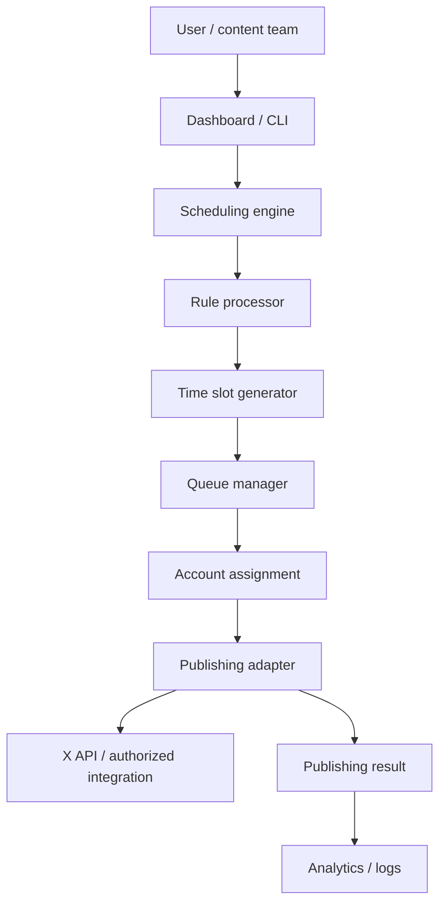

# X Bulk Scheduler Architecture

The repository implements the engine, queue records, CSV parsing, and a CLI preview. `PublishingAdapter` is a conceptual boundary for a future official integration. No endpoint or credential flow is assumed.
