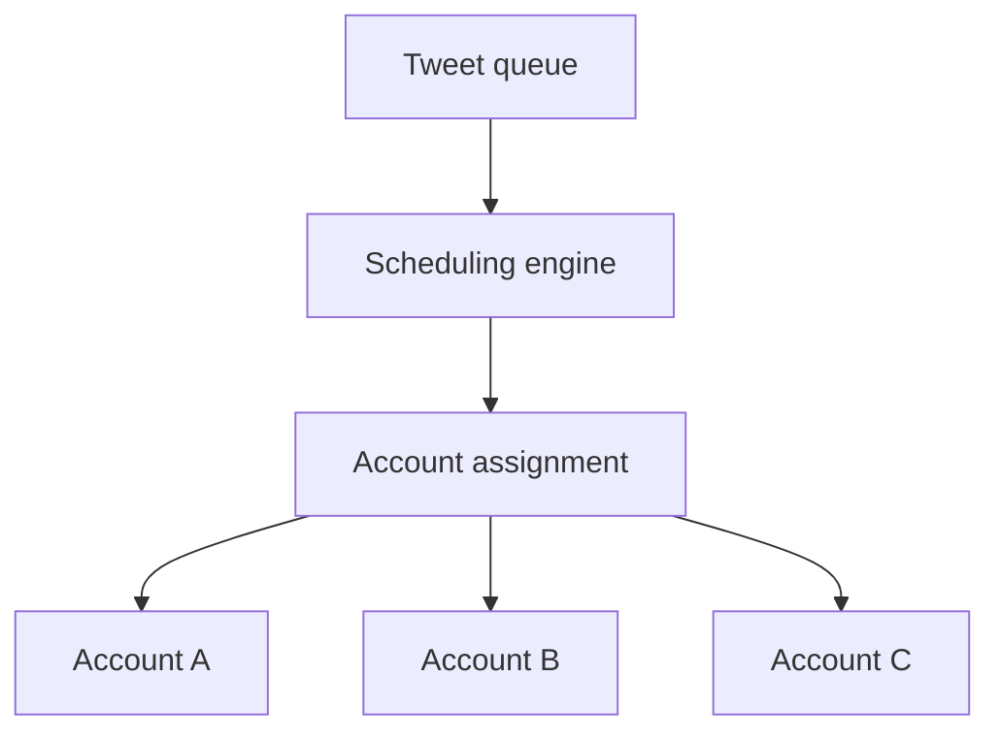

# Multi-Account Scheduling

Multi-account scheduling is a queue assignment problem, not an account acquisition problem. Keep account IDs authorized by the operator, assign content with a documented strategy, enforce per-account limits, and persist task/retry/publishing history.



The MVP provides round-robin assignment:

```js
const queue = assignAccounts(items, ["account-a", "account-b", "account-c"]);
```

Future adapters can add per-account capacity, retries, and publishing history. The project never creates accounts, collects credentials, or bypasses X verification.
