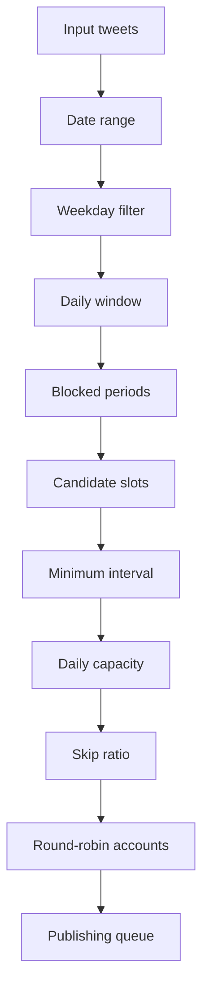

# Scheduling Model for a Bulk Tweet Scheduler

The engine transforms input tweets into candidate slots, then applies rules in a stable order:

`generateSchedule` walks each UTC date in the inclusive range. For an allowed weekday it chooses a deterministic daily count and candidate minute using a seeded pseudo-random generator. Candidates outside the window, inside blocked periods, too close to the previous accepted slot, or selected by the skip ratio are discarded. Tweets are assigned to the remaining slots in input order.

This order is useful because it makes a preview explainable. A production implementation may use a timezone-aware date library and a persistence layer, but should preserve the same observable constraints.
